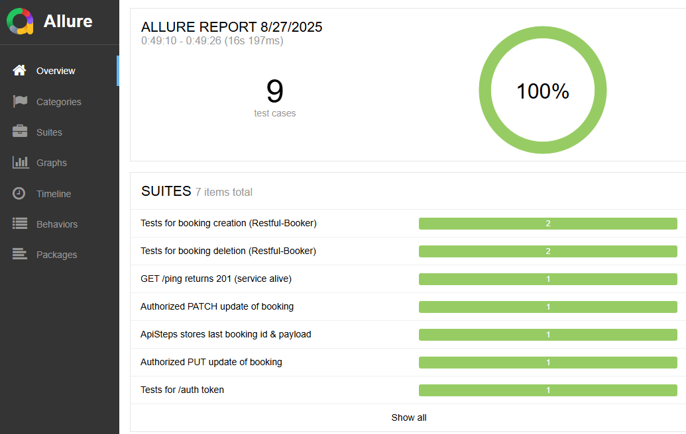
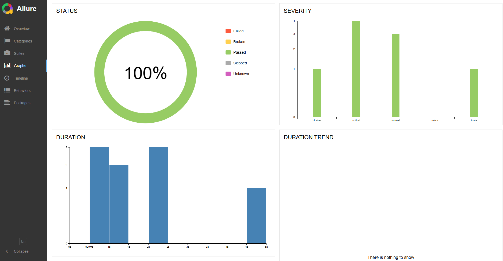

# Test project for automated API testing of the training platform for API automation [Restful-booker](https://restful-booker.herokuapp.com/apidoc/index.html)


## :scroll: Contents:

- [Technology stack used](#computer-technology-stack-used)
- [Description of tests](#pushpin-description-of-tests)
- [How to run the tests](#arrow_forward-how-to-run-the-tests)
- [Example of an Allure report](#-example-of-an-allure-report)
- [Graphs and charts](#-graphs-and-charts)


##  :computer: Technology stack used

* Java 17, Gradle, JUnit 5

* Rest-Assured (+ JSON Schema Validator)

* Allure (JUnit5 + Rest-Assured)

* AssertJ, Lombok, SLF4J

## :pushpin: Description of tests

> **Current suite targets Restful-Booker API.**

- ✓ **UserLoginTest** — verifies that `POST /auth` returns a non-empty token.  
- ✓ **HealthCheckTest** — verifies that `GET /ping` responds with `201` (service is alive).  
- ✓ **AddNewBookTest** — creates a booking, fetches it by id, validates response with JSON Schema; negative path: `PUT /booking/{id}` without token → `401/403`.  
- ✓ **UpdateBookingPutTest** — authorized `PUT /booking/{id}` updates all fields of an existing booking.  
- ✓ **PatchUpdateTest** — authorized `PATCH /booking/{id}` partially updates only the provided field(s) (e.g., `firstname`).  
- ✓ **DeleteBookTest** — positive: delete with a valid token (`201`); negative: delete with an invalid token (`403`).  
- ✓ **StepStateSmokeTest** — verifies that `ApiSteps` stores the last booking id and payload for convenience.

Allure report contents include:
* Test steps;
* Custom log files for request and response;


## :arrow_forward: How to run the tests


### Run the whole test suite
```
./gradlew clean test -DbaseUrl=https://restful-booker.herokuapp.com -Dheadless=true
```

### Run tests by tags (Auth/Booking)
```
./gradlew API
```

##  Example of an Allure report

<p align="center">

</p>

##  Graphs and charts

<p align="center">

</p>


